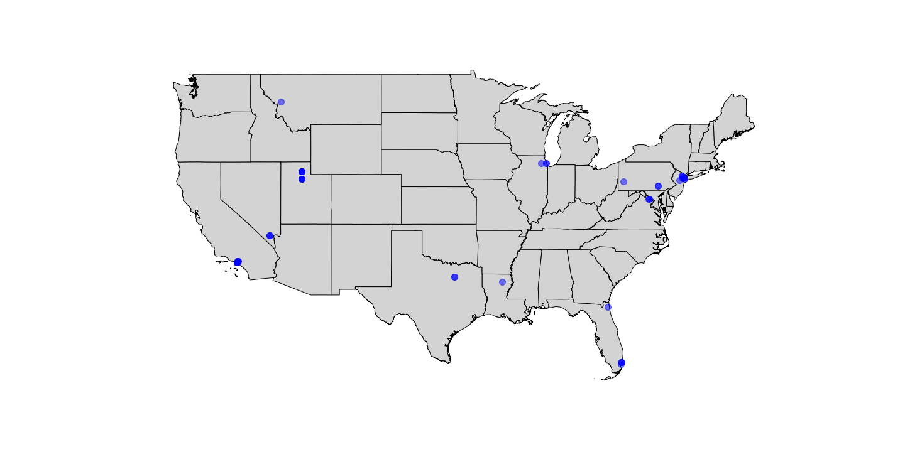

# Solana Validator Node Discovery


Building off of work from [bitcoin peer discovery](https://github.com/jnaulty/bitcoin-peers-discovery), I was curious about understanding the distribution of Solana validators on active on the network.

Solana makes this incredibly easy with the join of two JSON-RPC calls: [getClusterNodes](https://docs.solana.com/developing/clients/jsonrpc-api#getclusternodes) and [getVoteAccounts](https://docs.solana.com/developing/clients/jsonrpc-api#getvoteaccounts)


With this information, I can:

* acquire network address of all nodes on Solana
* identify all validators on the network 


The network address gives valuable information regarding the physical distribution of the Solana Validators.


Measured on September 2, 2022

## Validator Distribution by Country

* `26.5%` network addresses were traced to German ISPs
* `20.5%` network addresses were traced to American ISPs
* `27.9%` network addresses were traced to Finnish and French ISPs


One quick conclusion from the World Distribution From this dataset, it appears there is not a lot of nodes on the African, Antarctic, Asian, and South American continents.

## Validator Distribution by ISP

```
Organization Distribution Stats
Hetzner Online GmbH       0.363958
OVH SAS                   0.233216
RELIABLESITE              0.070671
WEBNX                     0.060071
PACKET                    0.042403
IS-AS-1                   0.028269
...
```


## Europe and German Distribution Info

Two European ISPs take up `59%` of the Solana Validators ISP Distribution they are [OVH SAS]() and [Hetzner Online GmbH]()


### German Distribution

Top German ISPs

```
Hetzner Online GmbH          0.800000
OVH SAS                      0.106667
Contabo GmbH                 0.026667
myLoc managed IT AG          0.026667
IP-Projects GmbH & Co. KG    0.013333
diva-e Datacenters GmbH      0.013333
PACKET                       0.013333
```


## USA Distribution Info

Top 10 ISPs in USA
```
RELIABLESITE             0.310345
WEBNX                    0.293103
IS-AS-1                  0.137931
PACKET                   0.086207
TIER-NET                 0.051724
PERFECT-INTERNATIONAL    0.034483
AMAZON-AES               0.017241
SERVER-MANIA             0.017241
LEVEL3                   0.017241
TERASWITCH               0.017241
```




## Special Thanks

Thanks for making this information easy to acquire!

* Solana makes this data free to all who can connect to the network
* `ip` information was retrieved by [ipapi.co](https://ipapi.co)